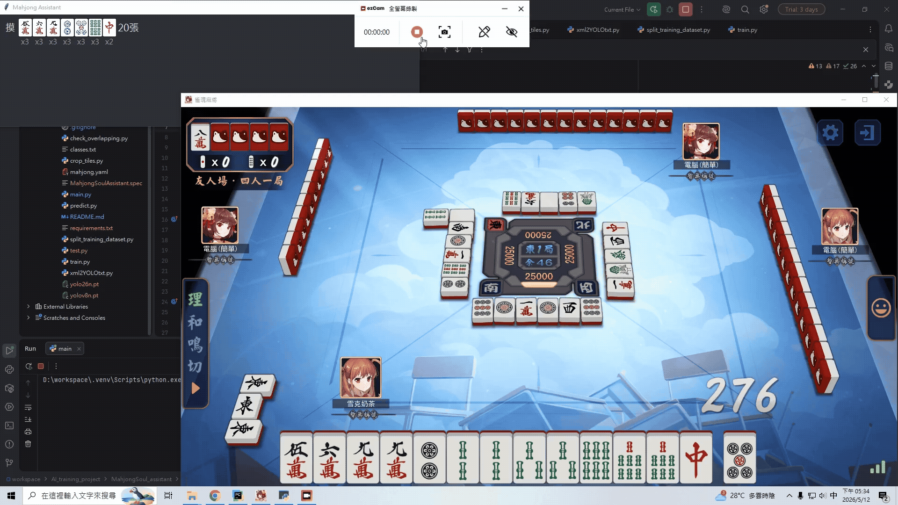

# Real-Time Mahjong AI Assistant

A real-time Mahjong assistant that uses YOLO-based tile detection
and live gameplay capture to recommend optimal discard decisions
through a graphical user interface.

## Demo



## Overview

This project is a real-time Mahjong assistant system that:

- Captures live Mahjong gameplay
- Detects Mahjong tiles using YOLO
- Analyzes the current hand state
- Recommends optimal discard decisions
- Displays recommendations through a graphical user interface

## Pipeline

```text
Live Gameplay Capture
    ↓
Mahjong Tile Detection
    ↓
Hand Analysis
    ↓
Discard Recommendation
    ↓
GUI Recommendation Display
```

## Features

- Real-time Mahjong gameplay analysis
- YOLO-based Mahjong tile recognition
- Automated hand state analysis
- Live discard recommendation engine
- Graphical recommendation interface

## Tech Stack

- Python
- YOLO
- OpenCV
- MSS
- Tkinter
- NumPy

## Installation

```bash
git clone <repository_url>
cd MahjongSoul_assistant
pip install -r requirements.txt
```

## Usage

Run the assistant:

```bash
python main.py
```

## Limitations

- Currently supports 4-player Mahjong only
- Decisions for chi / pon / kan / riichi / ron must be made manually by the player

## Training

Annotate training images:

```bash
labelImg
```

Generate YOLO annotation files, split the dataset, and train the model:

```bash
python xml2YOLOtxt.py
python split_training_dataset.py
python train.py
```

### Notes

- Confirm that the paths in `mahjong.yaml` are absolute paths
- Ensure that all labels in `classes.txt` are correct

## Future Work

- Add support for 3-player Mahjong
- Improve tile detection robustness
- Extend the recommendation system to support chi / pon / kan decisions